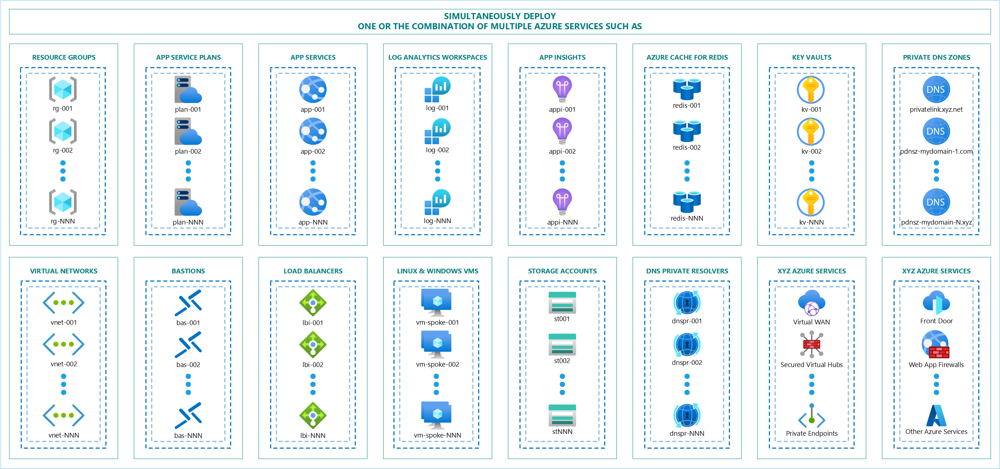
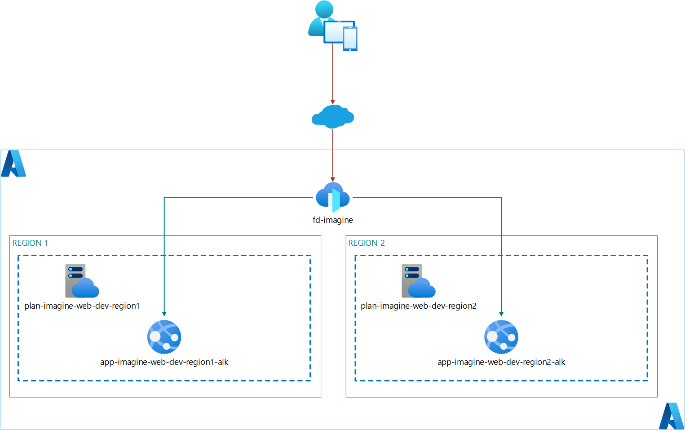
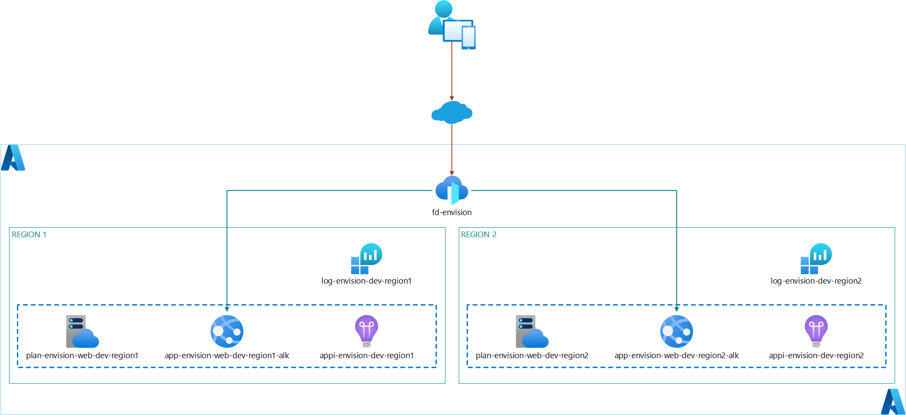
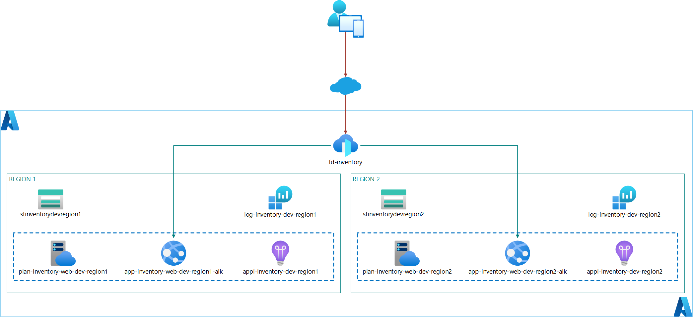
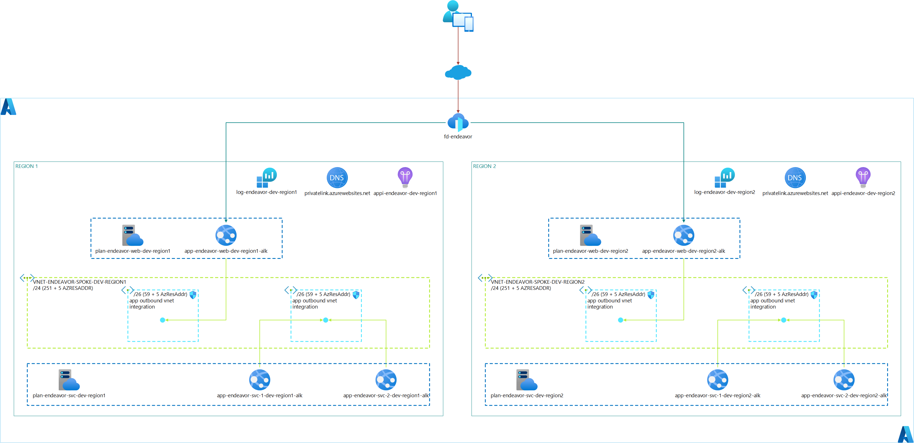
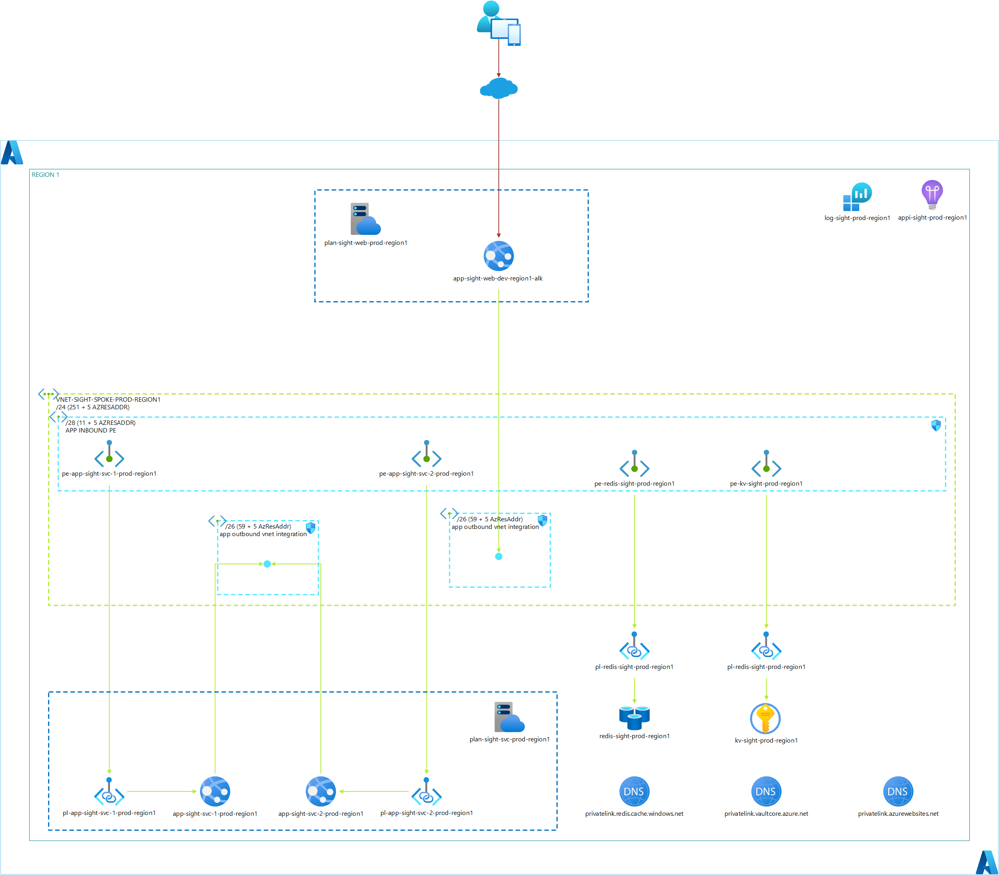
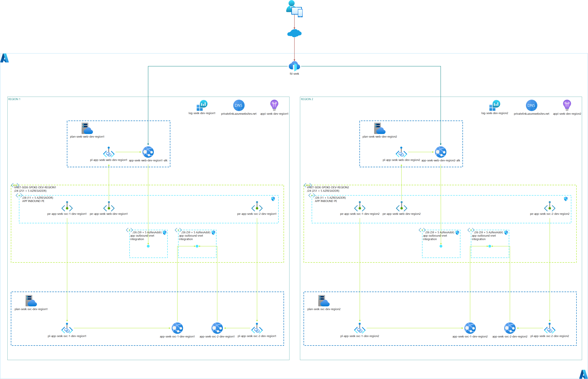
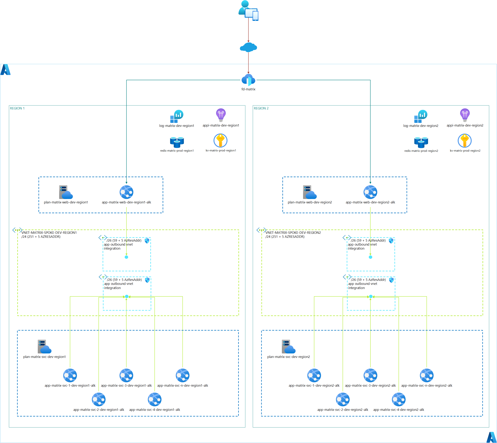
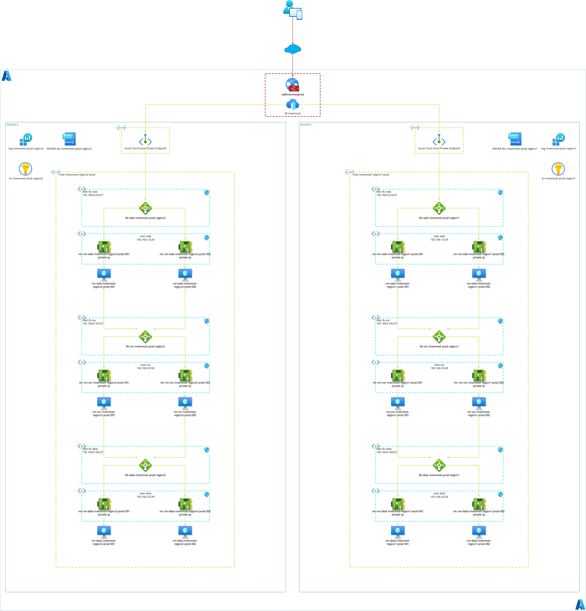
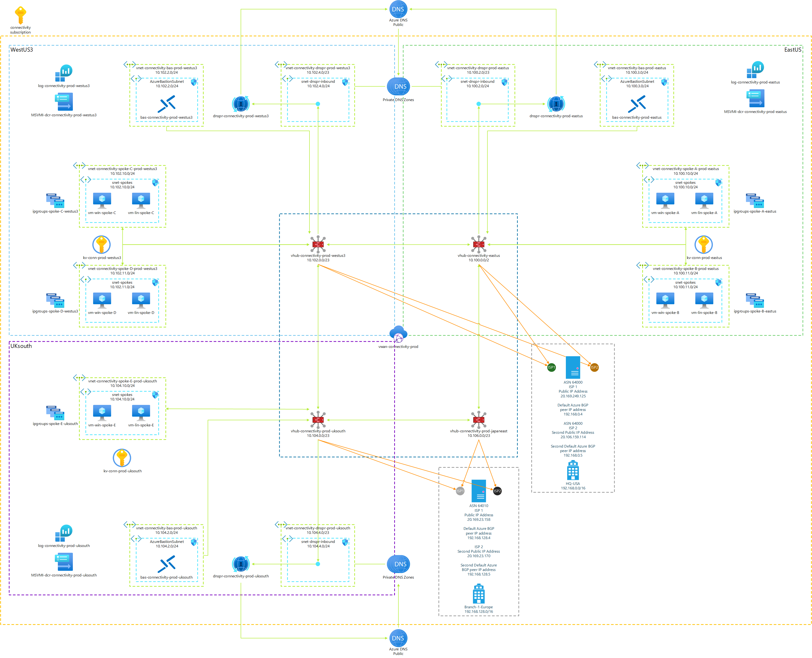

# Azure Bicephub

Public IaC repository to deploy secure Azure architectures at scale following best practices.

## Use Cases

### Simultaneously Deploy

- To multiple environments (e.g. dev, qa, uat, pre-prod, prod)
- To multiple regions for BCDR (eastus and westus3 | eastus2, centralus, uksouth and japaneast, etc.)
- One Azure Resource (e.g. 1 Front Door, 1 Internal Load Balancer, 1 Azure Cache for Redis, etc.)
- Multiple Azure Resources of the same type (e.g. 10 Private DNS Zones, 20 App Service Plans, 30 App Services, etc.)
- The Combination of Multiple Azure Services (1 Virtual Wan, 4 Secured Virtual Hubs, 4 Bastions, 1 Key Vault, etc.)



## Reference Architectures

[](https://github.com/ArtiomLK/azure-bicephub/actions/workflows/sight.yml)
[](https://github.com/ArtiomLK/azure-bicephub/actions/workflows/imagine.yml)
[](https://github.com/ArtiomLK/azure-bicephub/actions/workflows/envision.yml)
[](https://github.com/ArtiomLK/azure-bicephub/actions/workflows/inventory.yml)
[](https://github.com/ArtiomLK/azure-bicephub/actions/workflows/seek.yml)
[](https://github.com/ArtiomLK/azure-bicephub/actions/workflows/matrix.yml)
[](https://github.com/ArtiomLK/azure-bicephub/actions/workflows/heal.yml)
[](https://github.com/ArtiomLK/azure-bicephub/actions/workflows/design.yml)
[](https://github.com/ArtiomLK/azure-bicephub/actions/workflows/reach.yml)
[](https://github.com/ArtiomLK/azure-bicephub/actions/workflows/innermost.yml)
[](https://github.com/ArtiomLK/azure-bicephub/actions/workflows/connectivity.yml)
[](https://github.com/ArtiomLK/azure-bicephub/actions/workflows/alz-pdnsz.yml)

### Imagine

[](https://github.com/ArtiomLK/azure-bicephub/actions/workflows/imagine.yml)

- Azure Front Door
- Azure App Service Plan
- Azure App Services



```bash
# download bicep template file
curl -o imagine_template.bicep https://raw.githubusercontent.com/ArtiomLK/azure-bicephub/main/main.bicep

# download json parameters file
curl -o imagine_parameters.json https://raw.githubusercontent.com/ArtiomLK/azure-bicephub/main/parameters/fd-apps.json

az deployment sub create \
  --location '<region_name>' \
  --name imagine \
  --subscription '<sub_id>' \
  --template-file imagine_template.bicep \
  --parameters @imagine_parameters.json
```

### Envision

[](https://github.com/ArtiomLK/azure-bicephub/actions/workflows/envision.yml)

- Azure Front Door
- Azure App Service Plan
  - Azure App Services
- Azure App Insights
- Azure Log Analytics Workspace



```bash
# download bicep template file
curl -o envision_template.bicep https://raw.githubusercontent.com/ArtiomLK/azure-bicephub/main/main.bicep

# download json parameters file
curl -o envision_parameters.json https://raw.githubusercontent.com/ArtiomLK/azure-bicephub/main/parameters/fd-apps-appi.json

az deployment sub create \
  --location '<region_name>' \
  --name envision \
  --subscription '<sub_id>' \
  --template-file envision_template.bicep \
  --parameters @envision_parameters.json
```

### Inventory

[](https://github.com/ArtiomLK/azure-bicephub/actions/workflows/inventory.yml)

- Azure Front Door
- Azure App Service Plan
  - Azure App Services
- Azure App Insights
- Azure Log Analytics Workspace
- Azure Storage Account



```bash
# download bicep template file
curl -o inventory_template.bicep https://raw.githubusercontent.com/ArtiomLK/azure-bicephub/main/main.bicep

# download json parameters file
curl -o inventory_parameters.json https://raw.githubusercontent.com/ArtiomLK/azure-bicephub/main/parameters/fd-apps-appi.json

az deployment sub create \
  --location '<region_name>' \
  --name inventory \
  --subscription '<sub_id>' \
  --template-file inventory_template.bicep \
  --parameters @inventory_parameters.json
```

### Endeavor

[](https://github.com/ArtiomLK/azure-bicephub/actions/workflows/endeavor.yml)

- Azure Front Door
- Azure App Service Plan
  - Azure App Services
    - Virtual Network integration
- Azure App Insights
- Azure Log Analytics Workspace
- Azure Virtual Networks
- Azure Network Security Groups



```bash
# download bicep template file
curl -o endeavor_template.bicep https://raw.githubusercontent.com/ArtiomLK/azure-bicephub/main/main.bicep

# download json parameters file
curl -o endeavor_parameters.json https://raw.githubusercontent.com/ArtiomLK/azure-bicephub/main/parameters/fd-appsWvintegration-appi.json

az deployment sub create \
  --location '<region_name>' \
  --name endeavor \
  --subscription '<sub_id>' \
  --template-file endeavor_template.bicep \
  --parameters @endeavor_parameters.json
```

### Sight

[](https://github.com/ArtiomLK/azure-bicephub/actions/workflows/sight.yml)

- Azure Key Vault
  - Private Endpoints
- Azure Cache for Redis
  - Private Endpoints
- Azure App Service Plan
  - Azure App Services
    - Virtual Network integration
    - Private Endpoints
- Azure Virtual Networks
- Azure Network Security Groups
- Azure Private DNS Zones



```bash
# download bicep template file
curl -o sight_template.bicep https://raw.githubusercontent.com/ArtiomLK/azure-bicephub/main/main.bicep

# download json parameters file
curl -o sight_parameters.json https://raw.githubusercontent.com/ArtiomLK/azure-bicephub/main/parameters/appsWpeWvintegrationWpdnsz-appi-kvWpdnsz-redisWpdnsz.json

az deployment sub create \
  --location '<region_name>' \
  --name sight \
  --subscription '<sub_id>' \
  --template-file sight_template.bicep \
  --parameters @sight_parameters.json
```

### Seek

[](https://github.com/ArtiomLK/azure-bicephub/actions/workflows/seek.yml)

- Azure Front Door
- Azure App Service Plan
  - Azure App Services
    - Virtual Network integration
    - Private Endpoints
- Azure App Insights
- Azure Log Analytics Workspace
- Azure Virtual Networks
- Azure Network Security Groups
- Azure Private DNS Zones



```bash
# download bicep template file
curl -o seek_template.bicep https://raw.githubusercontent.com/ArtiomLK/azure-bicephub/main/main.bicep

# download json parameters file
curl -o seek_parameters.json https://raw.githubusercontent.com/ArtiomLK/azure-bicephub/main/parameters/fd-appsWpeWvintegrationWpdnsz-appi.json

az deployment sub create \
  --location '<region_name>' \
  --name seek \
  --subscription '<sub_id>' \
  --template-file seek_template.bicep \
  --parameters @seek_parameters.json
```

### Matrix

[](https://github.com/ArtiomLK/azure-bicephub/actions/workflows/matrix.yml)

- Azure Front Door
- Azure App Service Plan
  - Azure App Services
- Azure App Insights
- Azure Log Analytics Workspace
- Azure Key Vault
- Azure Cache for Redis
- Azure Virtual Networks
- Azure Network Security Groups



```bash
# download bicep template file
curl -o matrix_template.bicep https://raw.githubusercontent.com/ArtiomLK/azure-bicephub/main/main.bicep

# download json parameters file
curl -o matrix_parameters.json https://raw.githubusercontent.com/ArtiomLK/azure-bicephub/main/parameters/fd-apps-appi-kv-redis.json

az deployment sub create \
  --location '<region_name>' \
  --name matrix \
  --subscription '<sub_id>' \
  --template-file matrix_template.bicep \
  --parameters @matrix_parameters.json
```

### Heal

[](https://github.com/ArtiomLK/azure-bicephub/actions/workflows/heal.yml)

- Azure Front Door
  - Private Links to Origins
- Azure App Service Plan
  - Azure App Services
    - Virtual Network integration
    - Private Endpoints
- Azure Virtual Networks
- Azure Network Security Groups
- Azure Private DNS Zones


```bash
# download bicep template file
curl -o heal_template.bicep https://raw.githubusercontent.com/ArtiomLK/azure-bicephub/main/main.bicep

# download json parameters file
curl -o heal_parameters.json https://raw.githubusercontent.com/ArtiomLK/azure-bicephub/main/parameters/fdWpl-appsWpeWvintegrationWpdnsz-appi.json

az deployment sub create \
  --location '<region_name>' \
  --name heal \
  --subscription '<sub_id>' \
  --template-file heal_template.bicep \
  --parameters @heal_parameters.json
```

### Design

[](https://github.com/ArtiomLK/azure-bicephub/actions/workflows/design.yml)

- Azure Front Door
  - Private Links to Origins
- Azure Key Vault
  - Private Endpoints
- Azure App Service Plan
  - Azure App Services
    - Virtual Network integration
    - Private Endpoints
- Azure Virtual Networks
- Azure Network Security Groups
- Azure Private DNS Zones


```bash
# download bicep template file
curl -o design_template.bicep https://raw.githubusercontent.com/ArtiomLK/azure-bicephub/main/main.bicep

# download json parameters file
curl -o design_parameters.json https://raw.githubusercontent.com/ArtiomLK/azure-bicephub/main/parameters/fdWpl-appsWpeWvintegrationWpdnsz-appi-kvWpdnsz.json

az deployment sub create \
  --location '<region_name>' \
  --name design \
  --subscription '<sub_id>' \
  --template-file design_template.bicep \
  --parameters @design_parameters.json
```

### Reach

[](https://github.com/ArtiomLK/azure-bicephub/actions/workflows/reach.yml)

- Azure Front Door
  - Private Links to Origins
- Azure Key Vault
  - Private Endpoints
- Azure Cache for Redis
  - Private Endpoints
- Azure App Service Plan
  - Azure App Services
    - Virtual Network integration
    - Private Endpoints
- Azure Virtual Networks
- Azure Network Security Groups
- Azure Private DNS Zones


```bash
# download bicep template file
curl -o reach_template.bicep https://raw.githubusercontent.com/ArtiomLK/azure-bicephub/main/main.bicep

# download json parameters file
curl -o reach_parameters.json https://raw.githubusercontent.com/ArtiomLK/azure-bicephub/main/parameters/fdWpl-appsWpeWvintegrationWpdnsz-appi-kvWpdnsz-redisWpdnsz.json

az deployment sub create \
  --location '<region_name>' \
  --name reach \
  --subscription '<sub_id>' \
  --template-file reach_template.bicep \
  --parameters @reach_parameters.json
```

### Innermost

[](https://github.com/ArtiomLK/azure-bicephub/actions/workflows/innermost.yml)

- Azure Front Door
- Virtual Networks
- Internal Load Balancer



```bash
# download bicep template file
curl -o innermost_template.bicep https://raw.githubusercontent.com/ArtiomLK/azure-bicephub/main/main.bicep

# download json parameters file
curl -o innermost_parameters.json https://raw.githubusercontent.com/ArtiomLK/azure-bicephub/main/parameters/fdWpl-lbi.json

az deployment sub create \
  --location '<region_name>' \
  --name innermost \
  --subscription '<sub_id>' \
  --template-file innermost_template.bicep \
  --parameters @innermost_parameters.json
```

### Connectivity

[](https://github.com/ArtiomLK/azure-bicephub/actions/workflows/connectivity.yml)

- Secured Hub and Spoke Extension Pattern Architecture



```bash
# download bicep template file
curl -o connectivity_template.bicep https://raw.githubusercontent.com/ArtiomLK/azure-bicephub/main/main.bicep

# download json parameters file
curl -o connectivity_parameters.json https://raw.githubusercontent.com/ArtiomLK/azure-bicephub/main/parameters/vwan-vhub-vpng-bas-spokes.json

az deployment sub create \
  --location '<region_name>' \
  --name connectivity \
  --subscription '<sub_id>' \
  --template-file connectivity_template.bicep \
  --parameters @connectivity_parameters.json
```

### Azure Landing Zones PDNSZ

[](https://github.com/ArtiomLK/azure-bicephub/actions/workflows/alz-pdnsz.yml)

- Deploy all Azure Private DNS Zones

```bash
# download bicep template file
curl -o alz-pdnsz.bicep https://raw.githubusercontent.com/ArtiomLK/azure-bicephub/main/alz-pdnsz.bicep

tags='{"env":"dev", "project":"bicephub", "architecture":"alz-pdnsz"}'; echo $tags

az deployment group create \
  --name 'alz-pdnsz-deployment' \
  --resource-group 'rg-dns' \
  --template-file alz-pdnsz.bicep \
  --parameters vnet_id="/subscriptions/########-####-####-####-############/resourceGroups/<rg-name>/providers/Microsoft.Network/virtualNetworks/<vnet-name>" tags="$tags"
```
